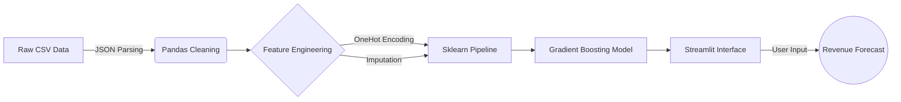

# 🎬 IMDb Strategic Analytics & Forecasting Engine

> **An end-to-end Machine Learning solution that transforms raw movie metadata into actionable box office intelligence.**

## 📖 Project Overview
The **IMDb Strategic Analytics Dashboard** is a full-stack data science project designed to answer the billion-dollar question: *What actually drives Box Office success?* Moving beyond simple charts, I engineered this system to process 5,000+ movie records, identifying high-ROI genres, analyzing budget efficiency, and simulating revenue outcomes using a custom Gradient Boosting Machine Learning model.

---

## 📸 App Gallery

| **1. Dashboard Overview** | **2.top 10 movies ** | **3.Executive Decision Support** |
|:---:|:---:|:---:|
|  |  |  |

| **4. ROI Analysis** | **5. Forcasting Model  |
|:---:|:---:|
|  |  |
| *Real-time revenue prediction* | *Additional insights or model metrics* |

---

## 🚀 Key Technical Highlights
*Unlike standard data visualizations, this project implements advanced engineering practices:*

* **🧬 Complex Data Engineering:** Engineered features from semi-structured data by parsing nested JSON strings (Genres, Keywords, Production Companies) into analyzable formats.
* **🤖 Production ML Pipelines:** Encapsulated preprocessing (Imputation, OneHotEncoding) and modeling into a single `scikit-learn Pipeline` to prevent data leakage and ensure reliable real-time inference.
* **🎨 Custom UI Architecture:** Developed the **"Onyx System"**—a bespoke CSS injection module that overrides Streamlit defaults to create a cinematic, responsive "Dark Mode" interface.
* **🛡️ Robust Error Handling:** Implemented a fault-tolerant "Smart Poster" engine that fetches high-res assets via API or generates dynamic placeholders when metadata is missing.

---

## 📊 Dashboard Features

### 1. 🏆 The Billion Dollar Club
A visual leaderboard of the top-grossing films, annotated with critical metrics (Revenue, Rating, Year).

### 2. 🌌 Strategic Analytics
* **3D Market Cube:** A 3-axis analysis of Budget vs. Revenue vs. Rating to identify the "Sweet Spot" for investment.
* **ROI Efficiency:** A line trend analysis showing how Return on Investment diminishes as Production Budget increases.
* **Genre Profitability:** A breakdown of which genres yield the highest pure profit margins.

### 3. 🧠 AI Forecasting Studio
An interactive simulator where stakeholders can adjust parameters (Budget, Hype Score, Genre) to predict a movie's financial performance using our trained **Gradient Boosting Regressor**.

---

## 🛠️ Tech Stack & Architecture

## ⚙️ Local Installation
To run this dashboard on your local machine:

1. **Clone the repository:**
   
   git clone [https://github.com/Wttcss/movie-analytics-dashboard.git](https://github.com/YOUR_USERNAME/movie-analytics-dashboard.git)
2. **Navigate to the project:**
    cd movie-analytics-dashboard
 3. **Install dependencies:**
    pip install -r requirements.txt
4. **Run the app:**
     streamlit run app.py

## 🔮 Future Improvements
While the current model achieves an **R² of ~0.75**, future roadmap items include:

* **NLP Analysis:** Using `TfidfVectorizer` on movie overviews to correlate plot keywords with revenue.
* **Star Power Index:** Scraping actor popularity data to quantify the "Cast Effect" on box office returns.
* **Inflation Adjustment:** Normalizing financial data to 2025 USD for historically accurate comparisons.

---
*Created by [Faisal Abdulaziz]*
